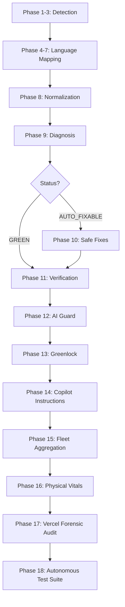

# 🧠 MERMEDA — Canonical Spec for the Living .repo-brain (v2.2.0)

This document defines the architecture, flow, responsibilities, and guarantees of the autonomous multi-repo brain system that governs your fleet of repositories.

---

## 1. System Flow (The 18-Phase Orchestration)

The `brain.run.sh` entrypoint orchestrates the following logic flow:

---

## 2. Operational Layer: Governance & Forensic Dashboard

The **Operator Dashboard** integrates the following specialized modules:

- **brain.doctor.sh**: Audits script integrity and runtime environment health.
- **brain.test.sh**: **NEW P18** - Validates management logic and security rules.
- **brain.firewall.sh**: Pre-commit hook that denies commits containing leaked secrets or unsafe logic.
- **brain.vercel.troubleshoot.sh**: Forensic analyzer for Vercel/Next.js deployment pathology.
- **brain.vitals.sh**: Captures physical repo metrics (size, commit age, build efficiency).
- **brain.autopsy.sh**: Forensic trace capture of logic execution.
- **brain.surgeon.sh**: Forced module repair and versioned restoration.
- **brain.immunizer.sh**: SHA-256 integrity locking against local management mutations.

---

## 3. Governance Contracts

- **Plumbing Stability**: The brain strictly repairs configuration and CI drift. Business logic is considered immutable unless specifically flagged by AI Guard.
- **Commit Guardrails**: The firewall ensures that no repository in the fleet can introduce critical security regression via local commits.
- **Verification Guarantee**: Every repair PR must pass the Phase 18 Test Suite before it is eligible for the `automerge` label.

---

## 4. Mission Control

The unified frontend acts as the **Operator Hub**, providing real-time telemetry, AI-powered strategic advisory, and one-click orchestration of the entire fleet genome.

Build by **CyberAI Oracle Network**
[www.CyberAi.network](http://www.CyberAi.network)